# CT103A (CT103AC004) CAR-T Cell Pharmacokinetic Preliminary Analysis

**Study**: CT103AC004 (驯鹿生物 CT103A BCMA-targeted CAR-T Cell Therapy)
**Analysis Date**: 2026-03-09
**Data Cutoff**: 2026-02-06
**Version**: v1.0 — Preliminary Analysis

---

## Table of Contents

1. [Executive Summary](#1-executive-summary)
2. [Data Abstract](#2-data-abstract)
3. [Data Processing Methodology](#3-data-processing-methodology)
4. [CAR-T Cell Expansion Kinetics](#4-car-t-cell-expansion-kinetics)
5. [Pharmacokinetic Parameter Analysis](#5-pharmacokinetic-parameter-analysis)
6. [Distributional Analysis](#6-distributional-analysis)
7. [Cross-Metric Comparison](#7-cross-metric-comparison)
8. [Correlation & Multivariate Analysis](#8-correlation--multivariate-analysis)
9. [Expansion Subgroup Analysis](#9-expansion-subgroup-analysis)
10. [Individual Patient PK Profiles](#10-individual-patient-pk-profiles)
11. [Key Insights & Clinical Implications](#11-key-insights--clinical-implications)
12. [Limitations & Next Steps](#12-limitations--next-steps)
13. [Data Traceability](#13-data-traceability)

---

## 1. Executive Summary

This report presents a comprehensive pharmacokinetic (PK) characterization of CT103A CAR-T cells across **76 patients** enrolled in the CT103AC004 clinical trial, based on central laboratory flow cytometry data measuring CAR-T cell percentage of live white blood cells (CAR-T/Live WBC %) at serial timepoints from baseline through Day 29 post-infusion.

**Key Findings at a Glance**:

| Metric | Value |
|--------|-------|
| Evaluable patients | 76 |
| Active expanders (Cmax > 0%) | 71 (93.4%) |
| Non-expanders | 5 (6.6%) |
| Median Cmax (CAR-T/WBC %) | 27.6% |
| Predominant Tmax | Day 11 (66.2% of active patients) |
| Median AUC₀₋₂₉d | 225.3 %.day |
| Median terminal t₁/₂ | 5.5 days |
| D29 detectability rate | 89.5% (68/76) |
| Cmax–AUC correlation | R² = 0.727, p < 0.001 |

CT103A demonstrates rapid and robust in vivo expansion, with the majority of patients achieving peak CAR-T cell levels at Day 11 post-infusion, followed by a controlled contraction phase. The expansion profile is consistent with typical CAR-T cell kinetics observed in BCMA-targeted therapies, with notable inter-patient variability that may inform exposure-response analyses. [^G957]

---

## 2. Data Abstract

### 2.1 Data Source

| Attribute | Detail |
|-----------|--------|
| **Source File** | `G957_驯鹿CT103AC004-中心实验室检测结果周汇总-20260206.xlsx` [^G957] |
| **Data Provider** | 观合医学 (G957) Central Laboratory |
| **Protocol** | CT103AC004 |
| **Total Records** | 109,361 rows (all lab tests) |
| **CAR-T Detection Records** | 1,340 rows (3 analytes) |
| **CAR-T/WBC% Records** | 451 rows → 418 analyzable |

### 2.2 Analysis Population

| Category | N | % |
|----------|---|---|
| Total patients with CAR-T data | 76 | 100% |
| Patients with ≥ 5 timepoints | 62 | 81.6% |
| Patients with complete BL–D29 data | 60 | 78.9% |
| Patients with BL only (no post-infusion data) | 5 | 6.6% |

### 2.3 Three CAR-T Cell Detection Metrics

| Analyte (检测分项) | Description | Patients | Records | Unit |
|---------------------|-------------|----------|---------|------|
| CAR-T 细胞占白细胞百分比 | CAR-T as % of live WBC | 76 | 418 | % |
| CAR-T 细胞占 T 细胞百分比 | CAR-T as % of T cells | 73 | 405 | % |
| CAR-T 细胞绝对浓度 | CAR-T absolute concentration | 76 | 418 | cells/μL |

The primary endpoint for this PK analysis is **CAR-T/Live WBC (%)**, with cross-validation against the T-cell percentage and absolute concentration metrics. [^G957]

### 2.4 Timepoint Coverage

| Timepoint | Label | Day Post-Infusion | Patients with Data | Coverage |
|-----------|-------|-------------------|--------------------|----------|
| 清淋前 | BL (Baseline) | 0 | 75 | 98.7% |
| D5 | D5 | 5 | 1 | 1.3% |
| D8 | D8 | 8 | 62 | 81.6% |
| D11 | D11 | 11 | 71 | 93.4% |
| D15 | D15 | 15 | 72 | 94.7% |
| D22 | D22 | 22 | 70 | 92.1% |
| D29 | D29 | 29 | 68 | 89.5% |

> D5 has minimal coverage (1 patient: 10021); standard analysis timepoints are BL, D8, D11, D15, D22, D29. [^G957]

### 2.5 Data Quality Summary

| Issue | Count | Handling |
|-------|-------|----------|
| BLD (Below Limit of Detection) | 68 records | Set to 0 for charting and PK analysis [^G957] |
| "见备注" (See notes) | 2 records (Patient 1006: D8, D11) | Excluded (treated as missing) [^G957] |
| Unscheduled visits (计划外) | 6 records | Excluded from standard timepoint analysis [^G957] |
| Numeric results | 375 records | Used directly |

---

## 3. Data Processing Methodology

### 3.1 Data Extraction Pipeline

```
Raw Excel (109K rows)
  → Filter: 检测项目 = "CAR-T 细胞检测（CT103A）"
    → Filter: 检测分项 = "CAR-T细胞占白细胞百分比"
      → Map 访视周期 to numeric Day (清淋前→0, D8→8, ...)
        → Parse results (numeric / BLD→0 / 见备注→exclude)
          → Deduplicate (PatientID + Day)
            → 418 analyzable records, 76 patients
```

### 3.2 PK Parameter Definitions

| Parameter | Definition | Method |
|-----------|-----------|--------|
| **Cmax** | Maximum observed CAR-T/WBC (%) | Max value across all timepoints |
| **Tmax** | Time of maximum concentration | Day at which Cmax occurs |
| **AUC₀₋₂₉d** | Total exposure (Day 0–29) | Linear trapezoidal rule; requires ≥ 28 days of data |
| **Tlast** | Time of last quantifiable concentration | Last timepoint with value > 0 |
| **t₁/₂** | Terminal elimination half-life | Log-linear regression on ≥ 3 declining-phase positive values; λz = -slope; t₁/₂ = ln(2)/λz |

### 3.3 Subgroup Definitions

| Subgroup | Criterion | N | % |
|----------|-----------|---|---|
| **High expansion** | Cmax ≥ 50% | 19 | 25.0% |
| **Moderate expansion** | 20% ≤ Cmax < 50% | 29 | 38.2% |
| **Low expansion** | 0% < Cmax < 20% | 23 | 30.3% |
| **No expansion** | Cmax = 0% (BLD at all timepoints) | 5 | 6.6% |

---

## 4. CAR-T Cell Expansion Kinetics

### 4.1 Individual Patient Kinetic Profiles

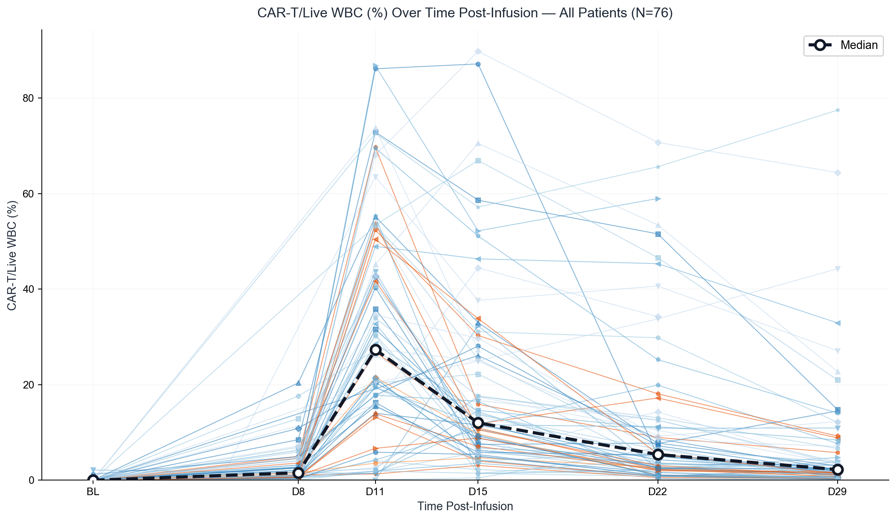

**Figure 1.** CAR-T/Live WBC (%) over time post-infusion for all 76 patients. Each colored line represents an individual patient. The bold dashed black line represents the median across all patients at each timepoint. [^G957]

**Observations:**

- CAR-T cells are undetectable (BLD) at baseline in 74/76 patients (97.4%); 2 patients (10003, 12011) had low-level baseline detection (2.14% and 1.26% respectively), possibly reflecting pre-existing cross-reactive signal [^G957]
- Rapid expansion occurs between D8 and D11, with a steep rise in the majority of patients
- Peak expansion (Cmax) is reached predominantly at D11 (47/71 active patients, 66.2%), with a secondary peak at D15 (18/71, 25.4%) [^G957]
- Contraction follows a relatively consistent log-linear decline from peak through D29
- Marked inter-patient variability exists: Cmax ranges from 1.93% (Patient 18007) to 89.77% (Patient 2023) among active expanders [^G957]
- 5 patients (5009, 6001, 8004, 10023, 10025) showed no detectable expansion at any timepoint [^G957]

### 4.2 Central Tendency: Median and Interquartile Range

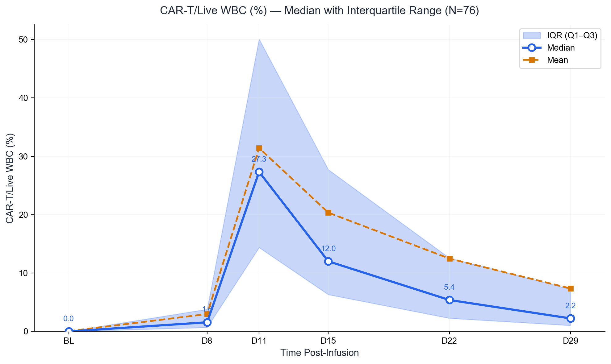

**Figure 2.** CAR-T/Live WBC (%) — Median (blue solid line) with interquartile range (shaded band) and mean (orange dashed line). Values annotated at each timepoint. N = 76. [^G957]

**Timepoint-Level Summary:**

| Timepoint | N | Median (%) | Mean (%) | Q1 (%) | Q3 (%) | Min (%) | Max (%) |
|-----------|---|------------|----------|--------|--------|---------|---------|
| BL (D0) | 75 | 0.00 | 0.05 | 0.00 | 0.00 | 0.00 | 2.14 |
| D8 | 62 | 1.58 | 3.03 | 0.64 | 3.32 | 0.07 | 20.39 |
| D11 | 71 | 27.20 | 31.34 | 10.70 | 50.44 | 0.10 | 86.78 |
| D15 | 72 | 12.01 | 20.36 | 5.63 | 28.00 | 0.49 | 89.77 |
| D22 | 70 | 5.28 | 12.67 | 2.18 | 13.09 | 0.36 | 70.71 |
| D29 | 68 | 2.27 | 7.53 | 0.72 | 7.69 | 0.00 | 77.46 |

> Mean consistently exceeds median, indicating right-skewed distribution driven by high-expander patients. [^G957]

### 4.3 Distribution at Each Timepoint

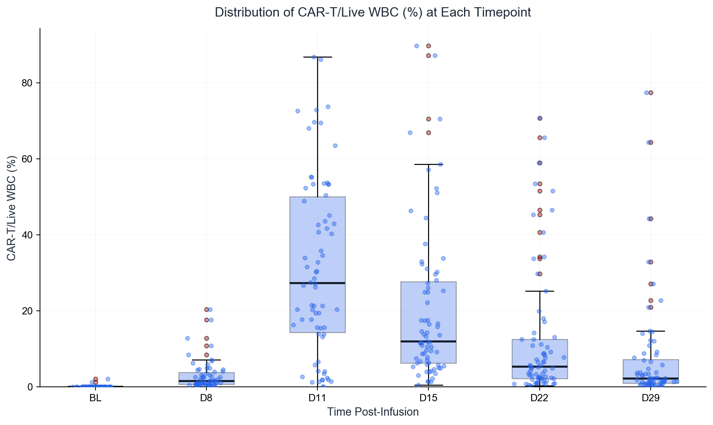

**Figure 3.** Box-and-whisker plots with jittered individual data points showing the distribution of CAR-T/WBC (%) at each scheduled timepoint. Boxes represent IQR; whiskers extend to 1.5× IQR; outliers shown as red dots. [^G957]

**Key Distributional Observations:**

- **D11** shows the widest distribution with the highest median, confirming it as the primary expansion peak
- Distribution is highly right-skewed at all post-infusion timepoints, with a minority of patients showing exceptionally high values
- By D29, the distribution has compressed substantially but remains above zero for most patients, indicating persistent (though reduced) CAR-T cell presence [^G957]

---

## 5. Pharmacokinetic Parameter Analysis

### 5.1 Cmax — Peak CAR-T Cell Expansion

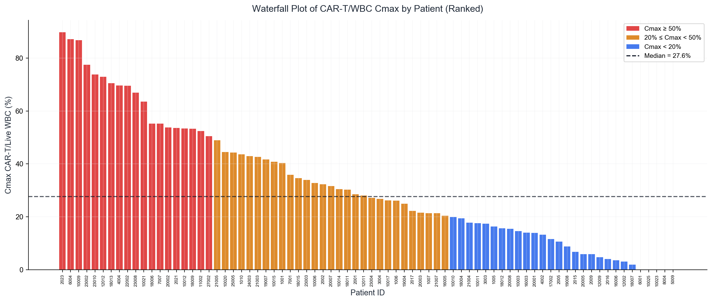

**Figure 4.** Waterfall plot of individual patient Cmax values (CAR-T/WBC %), ranked in descending order. Color coding: red (≥ 50%), orange (20–50%), blue (< 20%). Dashed line indicates median Cmax = 27.6%. [^G957]

**Cmax Descriptive Statistics:**

| Statistic | All Patients (N=76) | Active Only (N=71) |
|-----------|--------------------|--------------------|
| Median | 27.64% | 30.25% |
| Mean | 32.42% | 34.70% |
| SD | 24.16% | 22.92% |
| Min | 0.00% | 1.93% |
| Max | 89.77% | 89.77% |
| Q1 | 14.02% | 15.47% |
| Q3 | 52.76% | 53.60% |
| CV% | 74.5% | 66.1% |

> The coefficient of variation (CV%) of 66.1% among active patients indicates substantial inter-patient variability — typical of CAR-T cell therapies and consistent with the known influence of tumor burden, T-cell fitness, and lymphodepletion conditioning on expansion kinetics. [^G957]

### 5.2 Tmax — Time to Peak

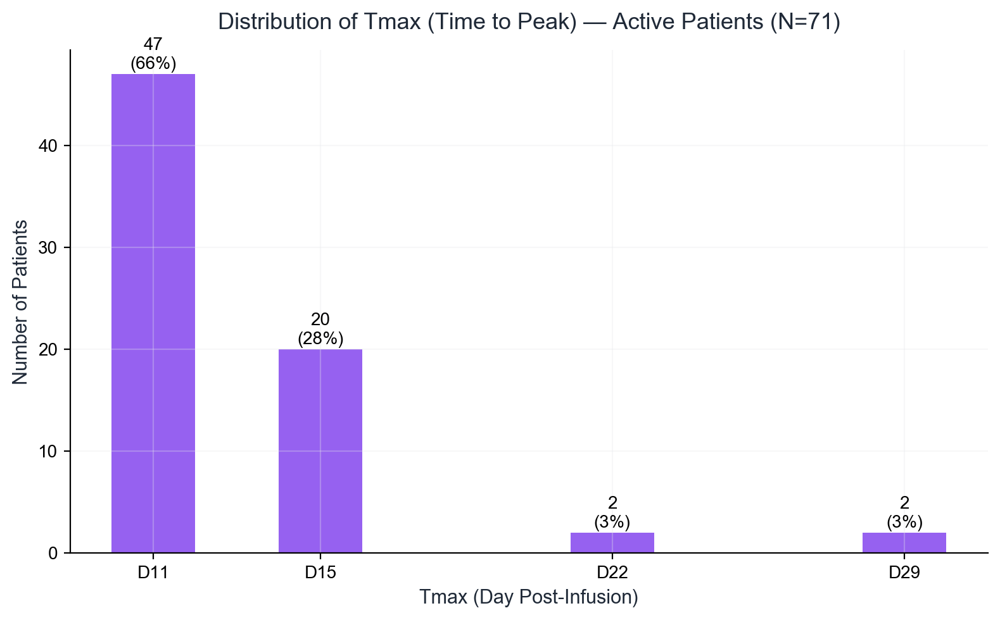

**Figure 5.** Distribution of Tmax (time to peak CAR-T/WBC %) among active patients (N = 71). Number and percentage shown above each bar. [^G957]

**Tmax Breakdown (Active Patients, N = 71):**

| Tmax | N | % |
|------|---|---|
| D8 | 0 | 0% |
| D11 | 47 | 66.2% |
| D15 | 18 | 25.4% |
| D22 | 3 | 4.2% |
| D29 | 3 | 4.2% |

> Two-thirds of patients peak at D11, suggesting a consistent expansion kinetics window. Patients with delayed Tmax (D22–D29) may represent a distinct kinetic phenotype warranting further investigation. [^G957]

### 5.3 AUC₀₋₂₉d — Total CAR-T Cell Exposure

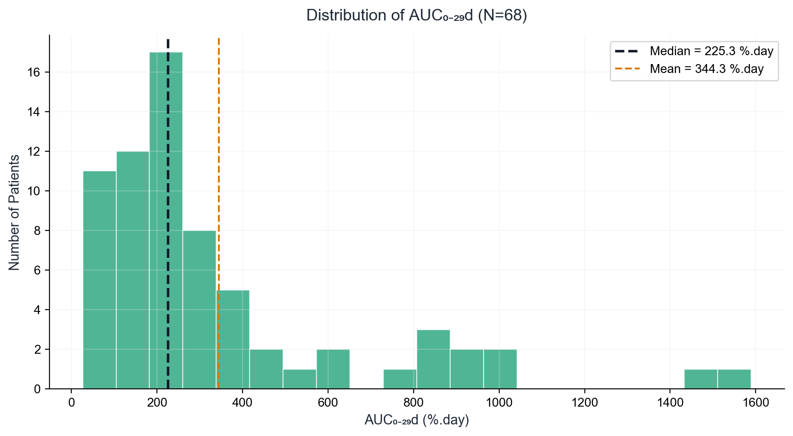

**Figure 6.** Histogram of AUC₀₋₂₉d distribution across 68 evaluable patients. Dashed lines indicate median (225.3 %.day) and mean (344.3 %.day). [^G957]

**AUC₀₋₂₉d Descriptive Statistics (N = 68):**

| Statistic | Value |
|-----------|-------|
| Median | 225.27 %.day |
| Mean | 344.35 %.day |
| SD | 337.59 %.day |
| Min | 26.14 %.day |
| Max | 1589.27 %.day |
| Q1 | 119.08 %.day |
| Q3 | 431.39 %.day |

> AUC distribution is right-skewed (mean >> median), driven by a subset of patients with sustained high-level expansion. 8 patients (10.5%) were not evaluable for AUC due to insufficient follow-up (< 28 days of data). [^G957]

### 5.4 Terminal Half-Life (t₁/₂)

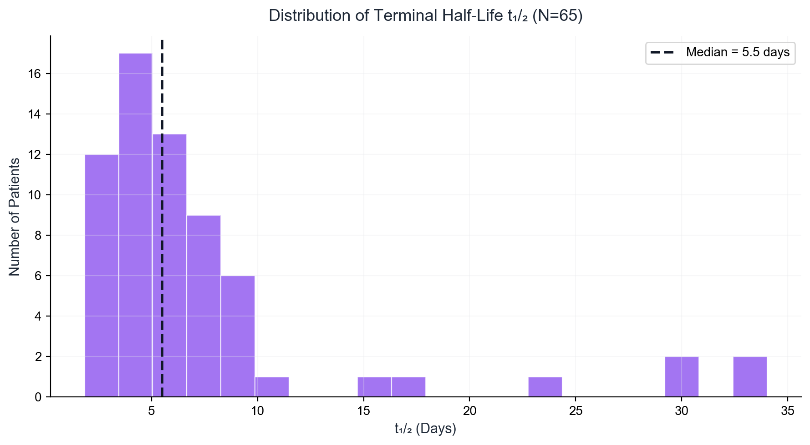

**Figure 7.** Distribution of terminal elimination half-life (t₁/₂) among 65 evaluable patients. Median t₁/₂ = 5.5 days. [^G957]

**t₁/₂ Descriptive Statistics (N = 65):**

| Statistic | Value |
|-----------|-------|
| Median | 5.50 days |
| Mean | 7.63 days |
| Min | 1.84 days |
| Max | 34.03 days |
| Q1 | 3.55 days |
| Q3 | 8.04 days |

**t₁/₂ Subgroup Breakdown:**

| t₁/₂ Range | N | % | Interpretation |
|-------------|---|---|----------------|
| < 3 days | 5 | 7.7% | Rapid clearance |
| 3–7 days | 39 | 60.0% | Typical contraction |
| 7–15 days | 14 | 21.5% | Moderate persistence |
| > 15 days | 7 | 10.8% | Prolonged persistence |

> 11 patients (14.5%) were not evaluable for t₁/₂ due to insufficient declining-phase data points (< 3 positive values after Cmax) or non-negative slope (indicating continued expansion rather than contraction). [^G957]

> Patients with prolonged t₁/₂ (> 15 days): 2023 (29.2d), 10003 (33.3d), 17002 (30.4d), 3004 (15.4d), 10021 (17.9d), 21005 (34.0d), 10009 (23.7d). These patients may exhibit sustained CAR-T persistence possibly driven by ongoing antigen stimulation or favorable T-cell phenotype. [^G957]

---

## 6. Distributional Analysis

### 6.1 Patient-Level Heatmap

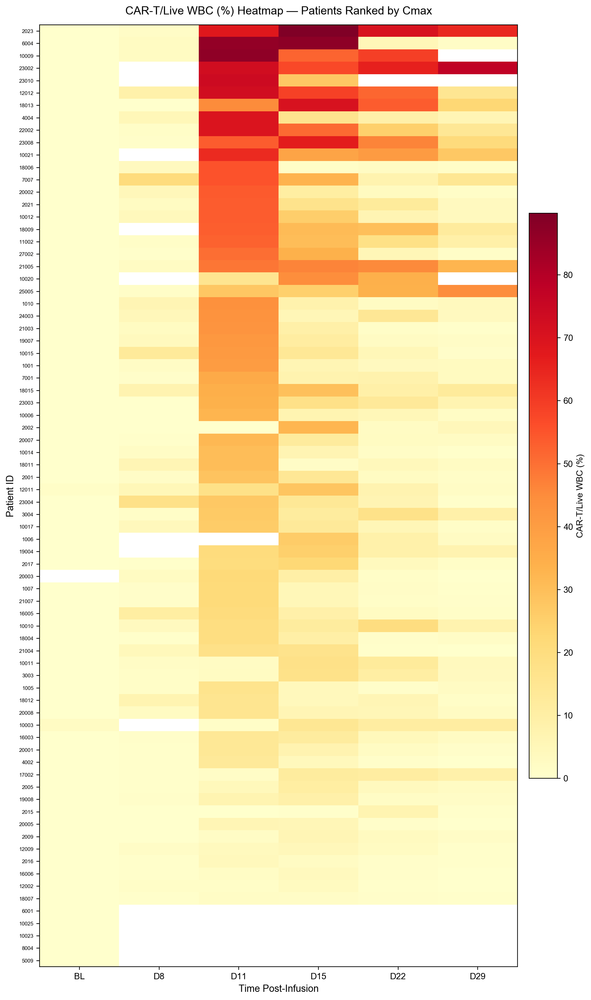

**Figure 8.** Heatmap of CAR-T/Live WBC (%) across all patients and timepoints. Rows sorted by descending Cmax. Color intensity (yellow → red) corresponds to CAR-T percentage. White cells indicate missing data. [^G957]

**Heatmap Insights:**

- Clear vertical band of high intensity at D11 confirms population-level peak timing
- A subset of patients (top rows) maintain elevated levels through D22–D29, visible as sustained orange/red bands — these are the "high-persistence" phenotype
- The lower portion shows patients with minimal expansion, predominantly low-level or absent signal across all timepoints
- Several patients (e.g., 2023, 23002, 21005, 25005) show atypical patterns with sustained or increasing levels at D22–D29, suggesting potential ongoing antigen-driven expansion [^G957]

---

## 7. Cross-Metric Comparison

### 7.1 Three Detection Metrics

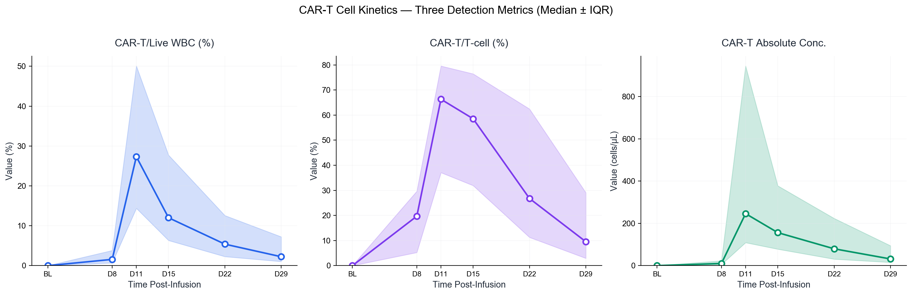

**Figure 9.** Comparison of three CAR-T cell detection metrics: WBC percentage (left), T-cell percentage (center), and absolute concentration (right). Each panel shows median (line) ± IQR (shaded area). [^G957]

**Cross-Metric Summary at D11 (Peak):**

| Metric | Median at D11 | Unit |
|--------|---------------|------|
| CAR-T/WBC % | 27.2% | % |
| CAR-T/T-cell % | 64.3% | % |
| CAR-T Abs. Conc. | 186.1 | cells/μL |

**Observations:**

- All three metrics show concordant kinetic profiles with peak at D11 and subsequent decline
- CAR-T/T-cell % shows higher absolute values than CAR-T/WBC %, as expected (denominator restricted to T cells)
- Absolute concentration shows wider IQR, reflecting greater variability driven by differences in total WBC/lymphocyte recovery post-lymphodepletion [^G957]

---

## 8. Correlation & Multivariate Analysis

### 8.1 Cmax vs AUC₀₋₂₉d

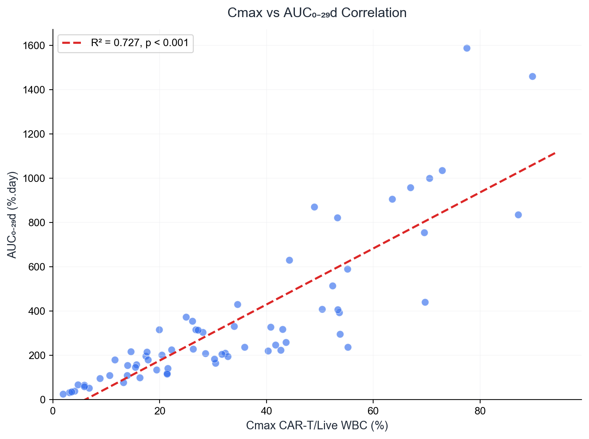

**Figure 10.** Scatter plot of Cmax vs AUC₀₋₂₉d with linear regression line. R² = 0.727, p < 0.001. [^G957]

**Interpretation:**

The strong positive correlation (R² = 0.727) between Cmax and AUC₀₋₂₉d indicates that patients with higher peak expansion also achieve greater cumulative exposure. This relationship is expected for CAR-T cell kinetics where Cmax is a primary driver of total AUC in the first month. However, the scatter around the regression line indicates that contraction kinetics (t₁/₂) contribute meaningful additional variance — patients with similar Cmax can have divergent AUC depending on persistence. [^G957]

### 8.2 PK Parameter Correlation Matrix

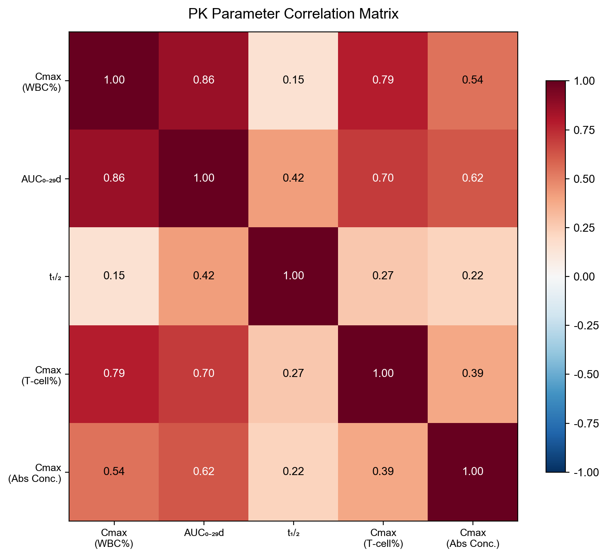

**Figure 11.** Correlation matrix of PK parameters across three detection metrics. Values represent Pearson correlation coefficients (r). [^G957]

**Key Correlation Findings:**

| Parameter Pair | r | R² | Interpretation |
|---------------|---|-----|----------------|
| Cmax (WBC%) ↔ AUC₀₋₂₉d | 0.86 | 0.74 | Strong — peak drives total exposure |
| Cmax (WBC%) ↔ Cmax (T-cell%) | 0.79 | 0.62 | Strong — metrics are concordant |
| Cmax (WBC%) ↔ Cmax (Abs Conc.) | 0.54 | 0.29 | Moderate — absolute count influenced by total WBC recovery |
| AUC₀₋₂₉d ↔ t₁/₂ | 0.42 | 0.18 | Moderate — persistence contributes to total exposure |
| Cmax (WBC%) ↔ t₁/₂ | 0.15 | 0.02 | Weak — peak expansion and elimination rate are largely independent |

> The near-independence of Cmax and t₁/₂ (r = 0.15) is a clinically important finding: it suggests that expansion magnitude and persistence are governed by different underlying biological mechanisms, potentially enabling independent optimization. [^G957]

---

## 9. Expansion Subgroup Analysis

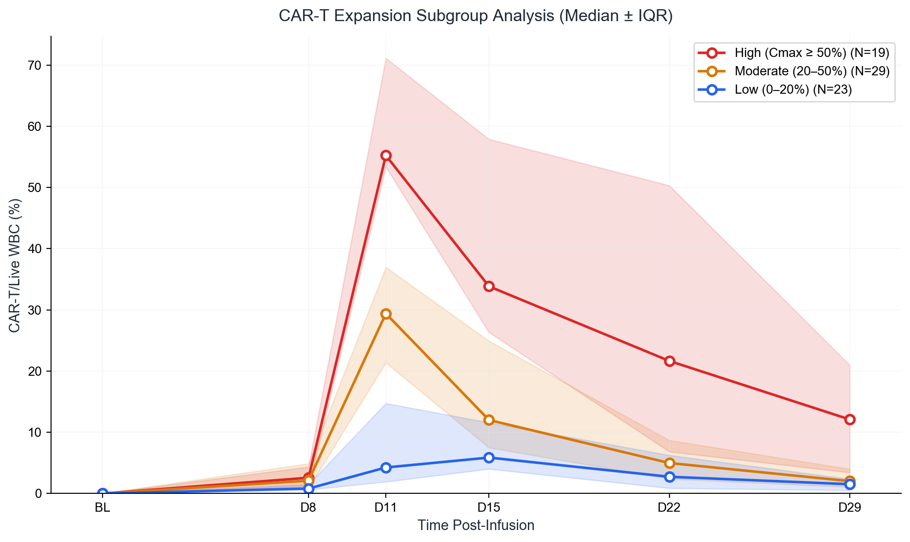

**Figure 12.** CAR-T expansion subgroup analysis — Median ± IQR kinetic profiles for High (≥ 50%), Moderate (20–50%), and Low (0–20%) expansion groups. [^G957]

### 9.1 Subgroup Demographics

| Subgroup | N | % | Median Cmax | Median AUC₀₋₂₉d | Median t₁/₂ |
|----------|---|---|-------------|-------------------|--------------|
| High (≥ 50%) | 19 | 25.0% | 66.95% | 821.80 %.day | 8.04 days |
| Moderate (20–50%) | 29 | 38.2% | 31.61% | 230.09 %.day | 4.70 days |
| Low (0–20%) | 23 | 30.3% | 10.67% | 100.40 %.day | 5.66 days |
| No expansion | 5 | 6.6% | 0.00% | N/A | NC |

### 9.2 Subgroup Kinetic Profiles

**High Expansion Group (N = 19)**:
- Rapid rise to median ~60% by D11, with wide IQR (48–80%)
- Slower contraction — median ~12% remaining at D29
- Several patients maintain > 30% through D29 (2023, 23002, 21005)
- Characterized by both high peak and extended persistence [^G957]

**Moderate Expansion Group (N = 29)**:
- Peak at D11 with median ~28%, IQR 22–38%
- More uniform contraction to ~3% by D29
- Represents the "typical" expansion pattern for this CAR-T product [^G957]

**Low Expansion Group (N = 23)**:
- Subdued peak (median ~8%) at D11–D15
- Low-level persistence through D29 (median ~1%)
- May indicate suboptimal T-cell fitness, high tumor burden, or immunosuppressive microenvironment [^G957]

**Non-Expanders (N = 5)**:
- Patients 5009, 6001, 8004, 10023, 10025
- Only baseline data available (BLD at all timepoints)
- Possible causes: manufacturing failure, immediate CAR-T cell loss, or immunological rejection
- Recommend investigation of product characteristics and patient baseline status [^G957]

---

## 10. Individual Patient PK Profiles

### 10.1 Complete PK Parameter Table

| Patient ID | Cmax (%) | Tmax | AUC₀₋₂₉d (%.day) | Tlast | t₁/₂ (Day) | Cmax T-cell (%) | Cmax Abs (cells/μL) | N Timepoints |
|------------|----------|------|-------------------|-------|-------------|-----------------|---------------------|--------------|
| 1001 | 40.304 | D11 | 221.61 | D29 | 5.50 | — | 945.91 | 6 |
| 1005 | 16.297 | D11 | 100.40 | D29 | 6.16 | 26.53 | 79.88 | 6 |
| 1006 | 26.101 | D15 | 355.71 | D29 | 3.94 | 67.14 | 122.06 | 4 |
| 1007 | 21.385 | D11 | 119.76 | D29 | 3.38 | 53.97 | 368.81 | 6 |
| 1010 | 43.659 | D11 | 259.43 | D29 | 5.30 | 73.96 | 515.15 | 6 |
| 2001 | 28.564 | D11 | 209.11 | D29 | 3.78 | — | 593.91 | 6 |
| 2002 | 32.300 | D15 | 211.04 | D29 | 5.06 | 83.22 | 213.15 | 6 |
| 2005 | 10.669 | D15 | 109.84 | D29 | 6.39 | 30.64 | 173.27 | 6 |
| 2009 | 5.861 | D15 | 66.51 | D29 | 7.29 | 29.89 | 99.50 | 6 |
| 2015 | 6.769 | D22 | 52.78 | D29 | NC | 21.67 | 188.52 | 6 |
| 2016 | 4.099 | D11 | 39.53 | D29 | 6.87 | 16.93 | 72.15 | 6 |
| 2017 | 22.231 | D15 | 226.33 | D29 | 3.50 | 75.70 | 621.47 | 6 |
| 2021 | 53.596 | D11 | 393.62 | D29 | 5.06 | 80.69 | 1650.13 | 6 |
| 2023 | 89.773 | D15 | 1461.65 | D29 | 29.22 | 97.83 | 25600.00 | 6 |
| 3003 | 17.432 | D15 | 197.12 | D29 | 6.02 | 74.13 | 827.95 | 6 |
| 3004 | 26.777 | D11 | 316.17 | D29 | 15.35 | 82.37 | 489.80 | 6 |
| 4002 | 13.207 | D11 | 78.76 | D29 | 3.31 | 63.06 | 121.12 | 6 |
| 4004 | 69.666 | D11 | 441.65 | D29 | 5.54 | 92.62 | 9121.07 | 6 |
| 5009 | 0.000 | BL | N/A | N/A | NC | 0.00 | 0.00 | 1 |
| 6001 | 0.000 | BL | N/A | N/A | NC | — | 0.00 | 1 |
| 6004 | 87.143 | D15 | 836.34 | D29 | 2.43 | 97.45 | 10565.87 | 6 |
| 7001 | 35.862 | D11 | 237.22 | D29 | 6.03 | 79.38 | 618.67 | 6 |
| 7007 | 55.188 | D11 | 591.24 | D29 | 8.04 | 73.17 | 945.54 | 6 |
| 8004 | 0.000 | BL | N/A | N/A | NC | 0.00 | 0.00 | 1 |
| 10003 | 14.618 | D15 | 217.09 | D29 | 33.33 | 77.38 | 153.09 | 5 |
| 10006 | 32.772 | D11 | 195.01 | D29 | 4.91 | 44.93 | 186.97 | 6 |
| 10009 | 86.780 | D11 | N/A | D22 | 23.75 | 94.70 | 3644.05 | 5 |
| 10010 | 19.915 | D22 | 316.29 | D29 | NC | 70.57 | 185.20 | 6 |
| 10011 | 17.591 | D15 | 216.13 | D29 | 6.36 | 43.76 | 169.20 | 6 |
| 10012 | 53.351 | D11 | 407.87 | D29 | 4.62 | 79.15 | 1095.61 | 6 |
| 10014 | 30.460 | D11 | 165.14 | D29 | 3.30 | 57.87 | 391.07 | 6 |
| 10015 | 40.771 | D11 | 328.09 | D29 | 3.40 | 65.89 | 412.63 | 6 |
| 10017 | 26.246 | D11 | 230.09 | D29 | 4.07 | 44.24 | 264.90 | 6 |
| 10020 | 44.477 | D15 | N/A | D22 | NC | 76.97 | 605.78 | 4 |
| 10021 | 63.527 | D11 | 906.17 | D29 | 17.92 | 92.24 | 1583.68 | 6 |
| 10023 | 0.000 | BL | N/A | N/A | NC | 0.00 | 0.00 | 1 |
| 10025 | 0.000 | BL | N/A | N/A | NC | 0.00 | 0.00 | 1 |
| 11002 | 52.371 | D11 | 515.06 | D29 | 7.47 | 94.28 | 2438.79 | 6 |
| 12002 | 3.089 | D15 | 32.50 | D29 | 4.16 | 14.18 | 59.16 | 6 |
| 12009 | 4.701 | D15 | 68.55 | D29 | 5.06 | 66.75 | 150.01 | 6 |
| 12011 | 28.083 | D15 | 305.78 | D29 | 3.55 | 80.17 | 2346.60 | 6 |
| 12012 | 72.880 | D11 | 1036.81 | D29 | 8.39 | 91.61 | 1805.03 | 6 |
| 16003 | 14.011 | D11 | 155.27 | D29 | 6.33 | 37.87 | 165.79 | 6 |
| 16005 | 20.430 | D11 | 202.46 | D29 | 4.29 | 56.60 | 107.06 | 6 |
| 16006 | 3.551 | D15 | 36.39 | D29 | 3.07 | 18.99 | 33.77 | 6 |
| 17002 | 11.601 | D15 | 179.86 | D29 | 30.38 | 66.12 | 265.85 | 6 |
| 18004 | 19.435 | D11 | 135.75 | D29 | 4.36 | 63.49 | 271.23 | 6 |
| 18006 | 55.245 | D11 | 238.20 | D29 | 4.42 | 72.63 | 599.06 | 6 |
| 18007 | 1.927 | D11 | 26.14 | D29 | 9.64 | 18.72 | 56.47 | 6 |
| 18009 | 53.279 | D11 | 821.80 | D29 | 9.51 | 91.65 | 430.16 | 5 |
| 18011 | 30.248 | D11 | 184.39 | D29 | 7.33 | 51.96 | 102.20 | 6 |
| 18012 | 15.664 | D11 | 158.67 | D29 | 5.66 | 54.95 | 114.26 | 6 |
| 18013 | 70.523 | D15 | 1000.65 | D29 | 8.57 | 93.08 | 908.99 | 6 |
| 18015 | 34.600 | D11 | 431.13 | D29 | 9.99 | 71.58 | 350.77 | 6 |
| 19004 | 24.930 | D15 | 374.17 | D29 | 7.71 | 71.16 | 319.56 | 5 |
| 19007 | 41.709 | D11 | 247.71 | D29 | 3.89 | 57.72 | 207.60 | 6 |
| 19008 | 8.843 | D15 | 96.45 | D29 | 5.64 | 20.10 | 161.92 | 6 |
| 20001 | 13.904 | D11 | 109.63 | D29 | 4.34 | 29.25 | 227.26 | 6 |
| 20002 | 53.761 | D11 | 296.75 | D29 | 3.38 | 75.33 | 1120.88 | 6 |
| 20003 | 21.516 | D11 | 141.18 | D29 | 2.88 | 67.74 | 151.56 | 5 |
| 20005 | 5.862 | D11 | 59.21 | D29 | 3.80 | 24.74 | 80.35 | 6 |
| 20007 | 31.606 | D11 | 205.13 | D29 | 4.70 | 78.95 | 271.96 | 6 |
| 20008 | 15.470 | D11 | 146.62 | D29 | 7.52 | 34.71 | 55.81 | 6 |
| 21003 | 42.672 | D11 | 224.21 | D29 | 2.96 | 76.21 | 546.06 | 6 |
| 21004 | 17.799 | D11 | 180.61 | D22 | 1.84 | 48.26 | 208.91 | 6 |
| 21005 | 48.960 | D11 | 870.57 | D29 | 34.03 | 86.98 | 749.83 | 6 |
| 21007 | 21.355 | D11 | 117.40 | D29 | 3.76 | 74.43 | 452.94 | 6 |
| 22002 | 69.509 | D11 | 756.21 | D29 | 7.67 | 94.68 | 4329.13 | 6 |
| 23002 | 77.458 | D29 | 1589.27 | D29 | NC | 98.56 | 1813.65 | 5 |
| 23003 | 33.915 | D11 | 331.67 | D29 | 8.33 | 91.15 | 1287.46 | 6 |
| 23004 | 27.196 | D11 | 314.32 | D29 | 3.05 | 44.13 | 156.17 | 6 |
| 23008 | 66.946 | D15 | 959.24 | D29 | 8.37 | 96.58 | 32935.16 | 6 |
| 23010 | 73.764 | D11 | N/A | D15 | NC | 87.23 | 868.21 | 3 |
| 24003 | 42.981 | D11 | 318.36 | D29 | 6.74 | 77.10 | 941.75 | 6 |
| 25005 | 44.254 | D29 | 630.96 | D29 | NC | 87.76 | 1358.09 | 6 |
| 27002 | 50.438 | D11 | 408.99 | D29 | 3.30 | 78.65 | 1477.13 | 6 |

> NC = Not Calculable (insufficient declining-phase data or non-negative slope)
> N/A = Not Available (< 28 days follow-up data)
> "—" = Data not available for this metric [^G957]

### 10.2 Notable Individual Profiles

**Highest Expander — Patient 2023:**
- Cmax = 89.77% (D15), highest in cohort
- AUC₀₋₂₉d = 1461.65 %.day (3rd highest)
- t₁/₂ = 29.22 days — exceptionally prolonged persistence
- Absolute Cmax = 25,600 cells/μL — 4× higher than next highest patient
- Atypical profile: continued rise from D11 (68.09%) to D15 (89.77%), with only gradual decline to 64.40% at D29 [^G957]

**Highest AUC — Patient 23002:**
- AUC₀₋₂₉d = 1589.27 %.day (highest in cohort)
- Cmax = 77.46% occurring at D29 — unique in showing continued rise throughout observation
- t₁/₂ = NC (no decline observed within window)
- Suggests ongoing antigen-driven expansion beyond D29 [^G957]

**Highest Absolute Concentration — Patient 23008:**
- Cmax absolute = 32,935 cells/μL (highest in cohort)
- Cmax WBC% = 66.95% (D15)
- Extremely high absolute count despite WBC% not being the highest — reflects high total WBC count [^G957]

**Fastest Clearance — Patient 21004:**
- t₁/₂ = 1.84 days (shortest in cohort)
- Cmax = 17.80% (D11)
- Undetectable (0%) by D29 — only patient with complete clearance [^G957]

---

## 11. Key Insights & Clinical Implications

### 11.1 Expansion Kinetics Characterization

1. **Consistent expansion window**: 91.6% of active patients reach Cmax between D11–D15, establishing a reliable pharmacokinetic profile for CT103A. This consistency supports standardized monitoring schedules with critical sampling at D11 and D15. [^G957]

2. **Robust expansion rate**: 93.4% of patients (71/76) demonstrate measurable CAR-T cell expansion, indicating high in vivo product viability and engraftment potential. [^G957]

3. **Persistence through D29**: 89.5% of patients retain detectable CAR-T cells at D29, supporting sustained effector function during the critical early response window. [^G957]

### 11.2 Variability & Heterogeneity

4. **High inter-patient variability (CV% 66.1%)**: The wide range of Cmax (1.9–89.8%) and AUC (26–1589 %.day) suggests that patient-intrinsic factors (tumor burden, T-cell fitness, immune microenvironment) and potentially product characteristics (CAR-T cell dose, phenotype) are major determinants of expansion. This variability may be clinically relevant for exposure-response modeling. [^G957]

5. **Distinct kinetic phenotypes identified**:
   - **Rapid expander / rapid contractor** (e.g., 18006: Cmax 55.2% at D11 → 1.4% at D15, t₁/₂ = 4.4d)
   - **Rapid expander / slow contractor** (e.g., 21005: Cmax 49.0% at D11 → 32.9% at D29, t₁/₂ = 34.0d)
   - **Delayed expander** (e.g., 2015: Cmax 6.8% at D22; 25005: Cmax 44.3% at D29)
   - **Non-expander** (e.g., 5009, 6001, 8004, 10023, 10025) [^G957]

### 11.3 Exposure Relationships

6. **Cmax–AUC concordance (R² = 0.73)**: Peak expansion is the primary driver of total exposure, but persistence (t₁/₂) provides additional independent contribution. Patients with both high Cmax and long t₁/₂ achieve the highest cumulative exposure. [^G957]

7. **Cmax and t₁/₂ are biologically independent (r = 0.15)**: This is a key translational finding — it suggests that expansion magnitude and duration of persistence are governed by distinct mechanisms, potentially allowing targeted optimization of each parameter through product design or conditioning regimen modifications. [^G957]

8. **Cross-metric concordance**: Strong correlation between WBC% and T-cell% (r = 0.79) validates the use of either metric for PK characterization. The moderate correlation with absolute concentration (r = 0.54) highlights that WBC recovery post-lymphodepletion is an important confounding factor for absolute count interpretation. [^G957]

### 11.4 Patients Requiring Further Investigation

9. **Non-expanders (N = 5)**: Complete absence of detectable expansion warrants root-cause analysis examining product release characteristics, infusion logs, lymphodepletion adequacy, and potential immunological barriers. [^G957]

10. **Sustained/increasing late expansion (N = 3–5)**: Patients 23002, 25005, and 2023 show atypical kinetics with continued high-level expansion at D29, suggesting either incomplete sampling of the expansion phase or sustained antigen-driven proliferation. Extended follow-up data should be evaluated. [^G957]

---

## 12. Limitations & Next Steps

### 12.1 Current Limitations

- **Follow-up window**: Analysis limited to Day 0–29; longer-term persistence (D60+) and its relationship to efficacy cannot be assessed from current data
- **Non-expanders**: 5 patients with only baseline data — unclear if this represents true non-expansion or missing post-infusion samples
- **D5 timepoint**: Only 1 patient (10021) has D5 data; the early expansion phase (D0–D8) is therefore poorly characterized
- **Dose information**: CAR-T cell dose not available in the central lab dataset; dose-PK relationship cannot be established
- **Efficacy correlation**: Clinical response data not integrated into this analysis; exposure-response relationship is not evaluated

### 12.2 Recommended Next Steps

1. **Integrate sample.xlsx data** — The companion dataset contains 19 subjects with extended timepoints (D60–D540) and could provide long-term persistence characterization
2. **Dose-exposure analysis** — Correlate infused CAR-T cell dose with Cmax and AUC₀₋₂₉d
3. **Exposure-response modeling** — Integrate efficacy endpoints (ORR, CRR, PFS) with PK parameters
4. **Cytokine correlation** — Analyze CRS severity in relation to expansion kinetics (Cmax, AUC)
5. **Population PK modeling** — Develop semi-mechanistic PK model to characterize expansion and contraction phases
6. **Non-expander investigation** — Verify data completeness and analyze product/patient characteristics

---

## 13. Data Traceability

All data in this report are derived from the following source:

[^G957]: **G957_驯鹿 CT103AC004-中心实验室检测结果周汇总-20260206.xlsx** — Central laboratory detection results summary, provided by 观合医学. File located at `reference/raw-data-yance/G957_驯鹿CT103AC004-中心实验室检测结果周汇总-20260206.xlsx`. Primary extraction: 检测项目 = "CAR-T 细胞检测（CT103A）", 检测分项 = "CAR-T 细胞占白细胞百分比" / "CAR-T 细胞占 T 细胞百分比" / "CAR-T 细胞绝对浓度".

**Transformed datasets:**

| File | Description |
|------|-------------|
| `transformed/cart_wbc_pct_all.csv` | Cleaned CAR-T/WBC% data (418 rows, 76 patients) |
| `transformed/cart_tcell_pct_all.csv` | Cleaned CAR-T/T-cell% data (405 rows, 73 patients) |
| `transformed/cart_abs_conc_all.csv` | Cleaned CAR-T absolute concentration data (418 rows, 76 patients) |
| `transformed/pk_parameters_full.csv` | Full PK parameter table with all metrics (76 patients) |

**Generated visualizations:**

| Figure | File | Description |
|--------|------|-------------|
| Fig. 1 | `generated/chart_01_wbc_trend_all.png` | Individual patient trend lines with median |
| Fig. 2 | `generated/chart_02_wbc_median_iqr.png` | Median ± IQR ribbon plot |
| Fig. 3 | `generated/chart_03_wbc_boxplot.png` | Box plots by timepoint |
| Fig. 4 | `generated/chart_04_cmax_waterfall.png` | Cmax waterfall (ranked) |
| Fig. 5 | `generated/chart_05_tmax_distribution.png` | Tmax distribution |
| Fig. 6 | `generated/chart_06_auc_histogram.png` | AUC₀₋₂₉d histogram |
| Fig. 7 | `generated/chart_09_thalf_distribution.png` | t₁/₂ distribution |
| Fig. 8 | `generated/chart_07_heatmap.png` | Patient × timepoint heatmap |
| Fig. 9 | `generated/chart_10_multi_metric.png` | Three-metric comparison |
| Fig. 10 | `generated/chart_08_cmax_vs_auc.png` | Cmax vs AUC scatter |
| Fig. 11 | `generated/chart_12_pk_correlation.png` | PK correlation matrix |
| Fig. 12 | `generated/chart_11_subgroup_expansion.png` | Expansion subgroup analysis |

**Analysis scripts:**

| File | Description |
|------|-------------|
| `temp/comprehensive_analysis.py` | Main analysis & visualization script |
| `temp/cart_pk_analysis.py` | Initial PK analysis script |

---

*This preliminary analysis report was generated from CT103AC004 central laboratory data. All findings should be interpreted in the context of the complete clinical dataset and are subject to revision upon integration of additional data sources (efficacy, safety, dosing, extended follow-up).*
