# CT103AC004 临床试验综合数据分析报告

## 1. 概述

### 1.1 分析目的

本报告基于 CT103AC004 CAR-T 细胞疗法（cilta-cel，驯鹿生物/Legend Biotech）治疗多发性骨髓瘤的多中心临床试验数据，执行以下分析：

1. **CAR-T 细胞药代动力学（PK）分析**：生成动力学曲线，计算关键 PK 参数（Cmax、Tmax、AUC0-28d、Tlast、t1/2）
2. **中心实验室数据质量评估**：评估数据完整性、异常样本、反审记录
3. **疾病生物标志物趋势分析**：M 蛋白、游离轻链（FLC）、免疫球蛋白、免疫固定电泳（IFE）等核心指标的随访变化
4. **PK-PD 关联探索性分析**：CAR-T 扩增参数与疾病应答标志物的关联

### 1.2 数据来源

| 数据源 | 文件名 | 数据量 | 说明 |
|--------|--------|--------|------|
| CAR-T 动力学数据 | `reference/raw-data-yance/sample.xlsx` | 338 行 × 4 列 | 18 例受试者，14 个时间点 + 退出访视，2 个检测指标 |
| 中心实验室检测结果 | `reference/raw-data-yance/G957_驯鹿CT103AC004-中心实验室检测结果周汇总-20260206.xlsx` | 109,237 行 × 18 列 | 27 个中心，229 例受试者，28 个检测项目 |

### 1.3 分析方法摘要

- **PK 参数计算**：采用非房室分析（NCA）方法。Cmax/Tmax 直接从观测数据获取；AUC 使用线性梯形法计算；t1/2 通过终末消除相对数线性回归估算（≥3 个下降点且 R² > 0.7）。BLD/BLQ 值在绘图时设为 0。
- **生物标志物趋势**：以中位数 + 四分位距（IQR）描述各时间点的集中趋势和离散程度。
- **PK-PD 关联**：Spearman 秩相关分析，探索性质，样本量有限。

---

## 2. 数据概览

### 2.1 CAR-T 动力学数据概况

- **受试者数**：18 例（ID: 1003, 1004, 1005, 1006, 1007, 1009, 1010, 1011, 1015, 1016, 1018, 1020, 1021, 1024, 1025, 1026, 1027, 1028）
- **时间点**：清淋前检查（BL, Day -5）、D1、D4、D7、D10、D14、D21、D28、D60、D90、D180、D270、D360、D540
- **检测指标**：
  - CAR-T 细胞占 T 细胞百分比（%）：159 个有效数据点
  - CAR-T 细胞绝对计数（cells/µL）：159 个有效数据点

**BLD/BLQ 分布**：

| 标记 | CAR-T/T-cell % | CAR-T 绝对计数 |
|------|---------------|---------------|
| BLD（低于检测限） | 75 | 75 |
| BLQ（低于定量限） | 13 | 13 |
| 数值型结果 | 81 | 81 |

> 数据来源：`reference/raw-data-yance/sample.xlsx`

### 2.2 中心实验室数据概况

- **总记录数**：109,237 条
- **中心数**：27 个（编号 1-28，缺编号 14）
- **受试者数**：229 例
- **检测项目**：28 个大类

**主要检测项目汇总**：

| 检测项目 | 记录数 | 类型 |
|---------|--------|------|
| 血清蛋白电泳 | 26,673 | 定量 |
| 尿免疫固定电泳(G-A-M-к-λ) | 9,384 | 定性 |
| 尿 IgD、IgE 免疫固定电泳 | 9,384 | 定性 |
| 血清免疫固定电泳 | 9,396 | 定性 |
| 血清 IgD、IgE 免疫固定电泳 | 9,396 | 定性 |
| 血清游离轻链 | 6,272 | 定量 |
| 24h 尿蛋白电泳含 M 蛋白含量 | 10,948 | 定量 |
| 24 小时尿蛋白定量 | 4,692 | 定量 |
| 微小残留病检测（多发性骨髓瘤） | 3,996 | 定量 |
| 免疫球蛋白 IgA/IgG/IgM 定量 | 各约 1,565 | 定量 |
| 血清总蛋白(TP) | 1,569 | 定量 |
| CAR-T 细胞检测（CT103A） | 1,340 | 定量 |
| BCMA 检测 | 948 | 定量 |
| 达雷妥尤(Dara)药物干扰移除检测 | 643 | 定量 |

> 数据来源：`reference/raw-data-yance/G957_驯鹿CT103AC004-中心实验室检测结果周汇总-20260206.xlsx`

### 2.3 受试者匹配情况

sample.xlsx 18 例受试者与中心实验室 229 例受试者的匹配结果：

| 项目 | 数量 |
|------|------|
| sample.xlsx 受试者 | 18 例 |
| 中心实验室受试者 | 229 例 |
| 匹配成功 | 8 例（1003, 1004, 1005, 1006, 1007, 1009, 1010, 1011） |
| 匹配失败 | 10 例（1015, 1016, 1018, 1020, 1021, 1024, 1025, 1026, 1027, 1028） |
| 匹配率 | 44.4% |

未匹配的 10 例受试者（ID 1015-1028）在中心实验室数据中不存在对应记录。匹配成功的 8 例均来自中心 1，这些受试者可用于 PK-PD 关联分析。

> 匹配规则：sample.xlsx 受试者 ID（整数）直接匹配中心实验室受试者筛选号

---

## 3. CAR-T 细胞药代动力学分析

### 3.1 CAR-T 细胞扩增动力学曲线

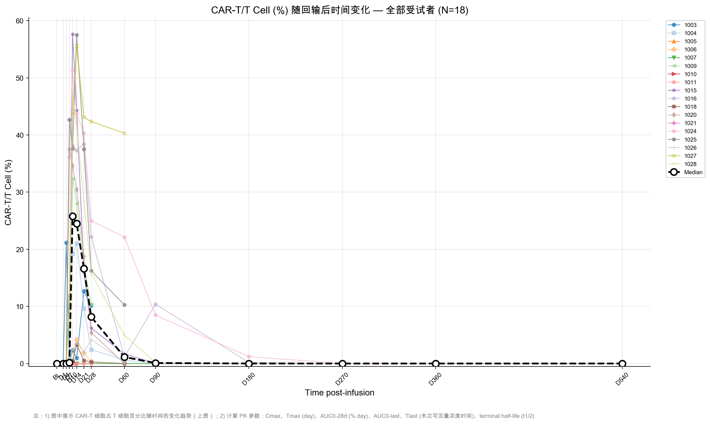

**图 3.1** 展示 18 例受试者 CAR-T 细胞占 T 细胞百分比随回输后时间的变化。个体间差异显著：部分受试者（如 1015、1025、1027）CAR-T 细胞峰值超过 50%，而部分受试者（1010、1011、1021）全程未检出可定量 CAR-T 细胞。

主要特征：
- 多数受试者在 D7-D14 期间达到扩增峰值
- 峰值后呈对数线性下降趋势
- 部分受试者在 D60 以后仍可检出 CAR-T 细胞，提示长期持续性
- 3 例受试者（1010、1011、1021）全程 BLD/BLQ，未见明显扩增

> 数据来源：`reference/raw-data-yance/sample.xlsx`，分析项="CAR-T 细胞占 T 细胞百分比"

### 3.2 CAR-T 细胞绝对计数动力学曲线

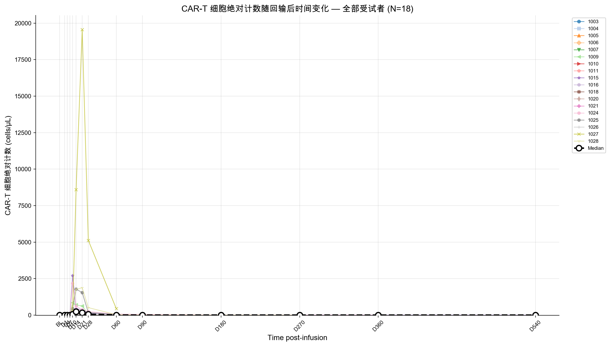

**图 3.2** 展示 CAR-T 细胞绝对计数动力学。受试者 1027 绝对计数峰值异常高（19,558.8 cells/µL），远高于其他受试者，提示该例可能存在特殊的扩增微环境或肿瘤负荷驱动效应。

> 数据来源：`reference/raw-data-yance/sample.xlsx`，分析项="CAR-T 细胞绝对计数"

### 3.3 PK 参数汇总

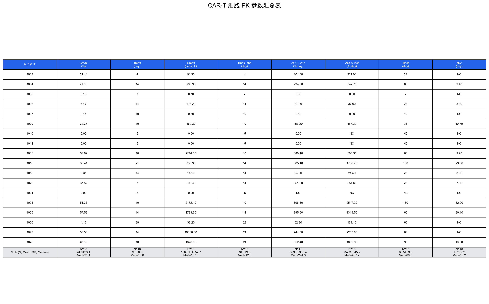

#### 3.3.1 Per-subject PK 参数表

| 受试者 ID | Cmax (%) | Tmax (day) | Cmax (cells/µL) | AUC0-28d (%.day) | AUC0-last (%.day) | Tlast (day) | t1/2 (day) |
|-----------|----------|------------|-----------------|-----------------|-------------------|-------------|------------|
| 1003 | 21.14 | 4 | 55.3 | 201.0 | 201.0 | 28 | NC |
| 1004 | 21.00 | 14 | 266.3 | 294.3 | 342.7 | 60 | 9.4 |
| 1005 | 0.15 | 7 | 0.7 | 0.6 | 0.6 | 7 | NC |
| 1006 | 4.17 | 14 | 106.2 | 37.9 | 37.9 | 28 | 3.8 |
| 1007 | 0.15 | 10 | 0.6 | 0.5 | 0.2 | 10 | NC |
| 1009 | 32.37 | 10 | 862.3 | 457.2 | 457.2 | 28 | 10.7 |
| 1010 | 0.00 | — | 0.0 | 0.0 | — | — | NC |
| 1011 | 0.00 | — | 0.0 | 0.0 | — | — | NC |
| 1015 | 57.67 | 10 | 2,714.5 | 580.1 | 706.3 | 60 | 9.9 |
| 1016 | 38.41 | 21 | 333.3 | 685.1 | 1,706.7 | 180 | 23.6 |
| 1018 | 3.31 | 14 | 11.1 | 24.5 | 24.5 | 28 | 3.9 |
| 1020 | 37.52 | 7 | 209.4 | 551.6 | 551.6 | 28 | 7.8 |
| 1021 | 0.00 | — | 0.0 | — | — | — | NC |
| 1024 | 51.36 | 10 | 2,172.1 | 898.3 | 2,547.2 | 180 | 32.2 |
| 1025 | 57.52 | 14 | 1,783.3 | 895.5 | 1,319.5 | 60 | 20.1 |
| 1026 | 4.16 | 28 | 39.2 | 62.3 | 134.1 | 60 | NC |
| 1027 | 55.55 | 14 | 19,558.8 | 944.8 | 2,267.8 | 60 | NC |
| 1028 | 46.86 | 10 | 1,876.0 | 652.4 | 1,062.0 | 90 | 10.5 |

> NC = Not Calculable（不可计算：终末期下降数据点不足 3 个或 R² ≤ 0.7）
> "—"表示全程 BLD/BLQ，无法确定有效时间点
> 数据来源：`reference/raw-data-yance/sample.xlsx`，NCA 方法计算

#### 3.3.2 描述性统计汇总

| 参数 | N | Mean ± SD | Median | Min | Max | Geometric Mean |
|------|---|-----------|--------|-----|-----|----------------|
| Cmax (%) | 18 | 23.96 ± 23.11 | 21.07 | 0.00 | 57.67 | 11.79 |
| Tmax (day) | 18 | 9.56 ± 8.58 | 10 | -5 | 28 | — |
| Cmax (cells/µL) | 18 | 1,666.1 ± 4,552.7 | 157.8 | 0.0 | 19,558.8 | 179.8 |
| AUC0-28d (%.day) | 17 | 369.8 ± 358.4 | 294.3 | 0.0 | 944.8 | 130.0 |
| AUC0-last (%.day) | 15 | 757.3 ± 845.2 | 457.2 | 0.2 | 2,547.2 | 168.6 |
| Tlast (day) | 15 | 60.5 ± 53.5 | 60 | 7 | 180 | 42.6 |
| t1/2 (day) | 10 | 13.2 ± 9.2 | 10.2 | 3.8 | 32.2 | 10.6 |

### 3.4 PK 特征总结

1. **扩增程度差异显著**：Cmax (%) 范围从 0（未扩增）到 57.67%，中位数 21.07%，变异系数（CV）约 96.5%，反映 CAR-T 扩增个体间差异极大。
2. **达峰时间集中**：排除未扩增者后，Tmax 主要分布在 D7-D14（10/15 例有扩增的受试者），符合 CAR-T 细胞典型扩增动力学。
3. **未扩增受试者**：3 例（1010、1011、1021，占 16.7%）全程未检出 CAR-T 细胞，可能与 T 细胞质量、肿瘤微环境或技术因素有关。
4. **长期持续性**：部分受试者（1016、1024）Tlast 达 180 天，提示 CAR-T 细胞可在体内长期存在。
5. **半衰期**：10/18 例可计算 t1/2，中位数 10.2 天（范围 3.8-32.2），2 例（1024、1016）t1/2 > 20 天，提示缓慢消除或持续增殖。

---

## 4. 中心实验室数据质量评估

### 4.1 数据完整性分析

**各列缺失率**：

| 列名 | 缺失率 | 说明 |
|------|--------|------|
| 方案编号 / 中心编号 / 受试者筛选号 | 0.00% | 完整 |
| 访视周期 / 样本类型 / 检测项目 / 检测分项 / 结果 | 0.00% | 完整 |
| 检验备注 | 50.78% | 约半数记录无备注 |
| 异常样本备注 | 99.11% | 仅 0.89% 有异常标记 |
| 申请单备注 | 99.67% | 极少使用 |
| 反审时间 | 96.82% | 仅 3.18% 有反审记录 |
| 反审备注 | 97.75% | 同上 |

**结论**：核心数据列（方案编号至结果）完整无缺失。备注类字段缺失率高属正常——仅在有特殊情况时填写。

> 数据来源：`reference/raw-data-yance/G957_驯鹿CT103AC004-中心实验室检测结果周汇总-20260206.xlsx`，全部 109,237 行

### 4.2 异常样本分析

异常样本共 975 条记录，占总记录数的 0.89%。

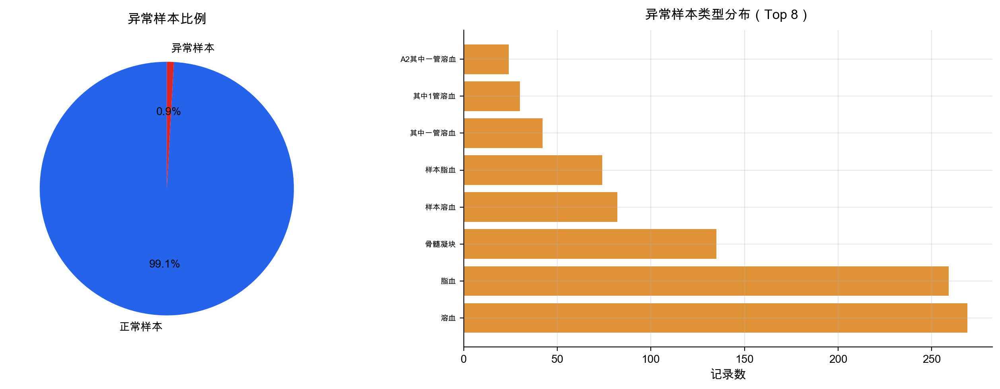

**主要异常类型**：

| 异常类型 | 记录数 | 占异常记录比例 |
|---------|--------|-------------|
| 溶血 | 269 | 27.6% |
| 脂血 | 259 | 26.6% |
| 骨髓凝块 | 135 | 13.8% |
| 样本溶血 | 82 | 8.4% |
| 样本脂血 | 74 | 7.6% |
| 其中一管溶血 | 42 | 4.3% |
| 其他 | 114 | 11.7% |

溶血和脂血是最常见的异常类型，可能影响部分生化检测结果的准确性，但整体异常比例较低（< 1%），对数据集总体质量影响有限。

> 数据来源：`reference/raw-data-yance/G957_驯鹿CT103AC004-中心实验室检测结果周汇总-20260206.xlsx`，"异常样本备注"列

### 4.3 反审记录分析

反审记录共 3,470 条，占总记录数的 3.18%。

**主要反审原因**：

| 反审原因分类 | 记录数 |
|------------|--------|
| 访视周期由其他命名更正为"计划外" | 约 1,100 |
| 访视周期编号更正（如 C12D1 → C11D1） | 118 |
| 桥接治疗访视命名规范化 | 74 |
| 姓名缩写更正 | 84 |
| 其他信息填写更正 | 约 2,094 |

反审原因以信息填写错误（特别是访视周期命名变更）为主，属于数据管理过程中的常规修正，未涉及检测结果的实质性变更。

> 数据来源：`reference/raw-data-yance/G957_驯鹿CT103AC004-中心实验室检测结果周汇总-20260206.xlsx`，"反审时间"和"反审备注"列

### 4.4 各中心数据质量对比

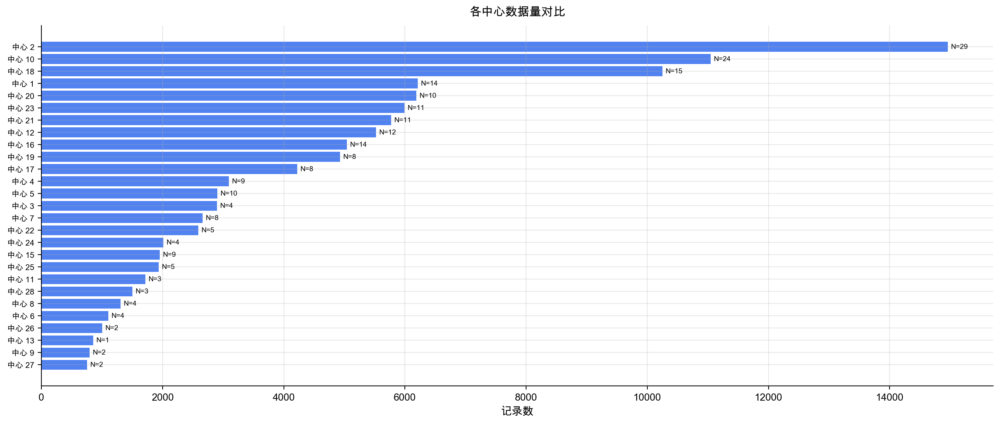

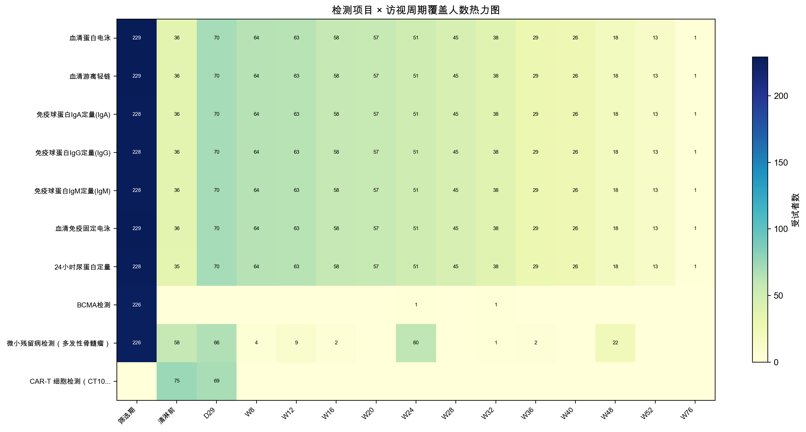

**各中心数据量（前 5 名）**：

| 中心编号 | 受试者数 | 记录数 |
|---------|---------|--------|
| 2 | 29 | 14,960 |
| 10 | 24 | 11,048 |
| 18 | 15 | 10,252 |
| 1 | 14 | 6,212 |
| 20 | 10 | 6,191 |

中心 2 数据量最大（29 例受试者，14,960 条记录），中心间数据量差异与各中心入组受试者数直接相关。

> 数据来源：`reference/raw-data-yance/G957_驯鹿CT103AC004-中心实验室检测结果周汇总-20260206.xlsx`，按"中心编号"分组统计

---

## 5. 疾病生物标志物趋势分析

### 5.1 血清蛋白电泳（M 蛋白）

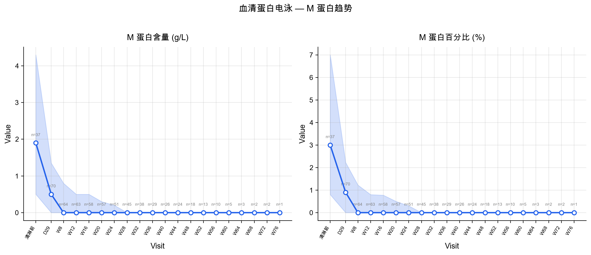

M 蛋白含量（g/L）和百分比（%）随访视周期的变化趋势展示了治疗后 M 蛋白的整体下降模式。清淋前基线水平经治疗后逐步降低，至后期随访（W24 及以后）趋于稳定或接近检测限，反映了 CAR-T 治疗对多发性骨髓瘤肿瘤负荷的有效控制。

> 数据来源：`reference/raw-data-yance/G957_驯鹿CT103AC004-中心实验室检测结果周汇总-20260206.xlsx`，检测项目="血清蛋白电泳"，检测分项="M 蛋白含量"/"M 蛋白百分比"

### 5.2 血清游离轻链（FLC）

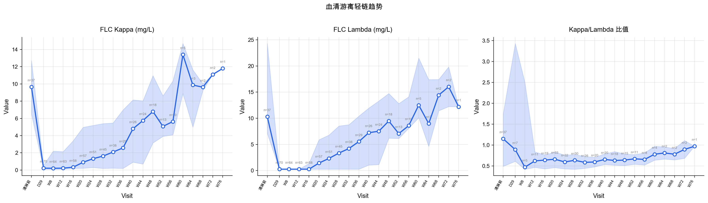

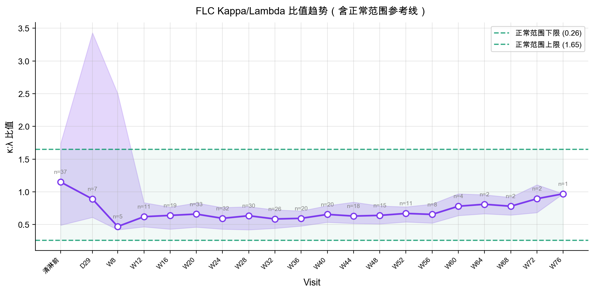

FLC Kappa/Lambda 比值趋势图显示，治疗后 FLC 比值逐步趋向正常范围（0.26-1.65，绿色虚线标示），反映异常克隆轻链产生的减少。部分受试者在早期随访时 FLC 比值即进入正常范围，提示早期深度应答。

> 数据来源：`reference/raw-data-yance/G957_驯鹿CT103AC004-中心实验室检测结果周汇总-20260206.xlsx`，检测项目="血清游离轻链"，检测分项="血清游离轻链 Kappa"/"血清游离轻链 Lambda"/"κ:λ 比值"

### 5.3 免疫球蛋白定量（IgA/IgG/IgM）

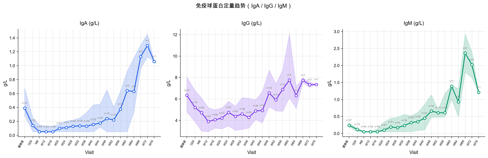

免疫球蛋白三个亚型的变化趋势：

- **IgG**：多发性骨髓瘤中常异常升高（若为 IgG 型骨髓瘤）或受抑（非受累免疫球蛋白）。CAR-T 治疗后，由于 BCMA 靶向作用导致浆细胞减少，正常免疫球蛋白水平可能进一步下降，后期随免疫重建逐步恢复。
- **IgA** 和 **IgM**：类似模式，治疗后早期可能降低，随后缓慢恢复。

> 数据来源：`reference/raw-data-yance/G957_驯鹿CT103AC004-中心实验室检测结果周汇总-20260206.xlsx`，检测项目="免疫球蛋白 IgA/IgG/IgM 定量"

### 5.4 免疫固定电泳（IFE）

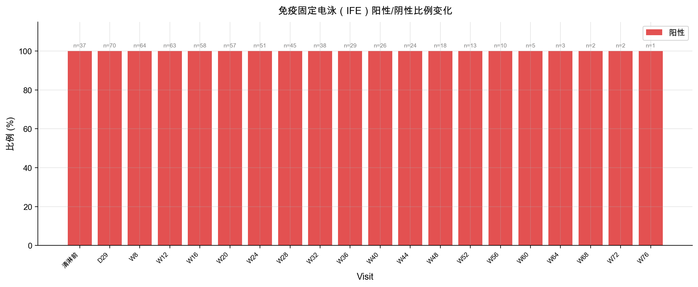

IFE 结果为定性检测。阳性结果表示存在单克隆免疫球蛋白（M 蛋白），阴性结果表示未检出。随治疗时间推移，IFE 阳性率逐步下降，阴性率上升，反映越来越多受试者达到免疫固定电泳阴性（更深层的治疗应答）。

常见 M 蛋白类型包括 IgG κ 型、IgG λ 型、IgA λ 型等，与多发性骨髓瘤的异常克隆类型一致。

> 数据来源：`reference/raw-data-yance/G957_驯鹿CT103AC004-中心实验室检测结果周汇总-20260206.xlsx`，检测项目="血清免疫固定电泳"，检测分项="结果解释"

### 5.5 Daratumumab 干扰去除检测

达雷妥尤（Daratumumab, Dara）药物干扰移除检测共有 643 条记录，涉及 53 例受试者。检测分项包括：

| 检测分项 | 说明 |
|---------|------|
| 原 M 蛋白含量 | 未去除药物干扰前的 M 蛋白含量 |
| 纠正后 M 蛋白含量 | 去除干扰后的 M 蛋白含量 |
| 药物移除后 M 蛋白 | 药物干扰移除后检测结果 |
| 是否存在达雷妥尤药物干扰 | 干扰判定结果 |

该检测用于消除桥接治疗中 Daratumumab（抗 CD38 单抗）对 IFE/SPEP 的干扰。对于接受含 Daratumumab 方案桥接治疗的受试者，去除干扰后的结果更准确地反映真实 M 蛋白水平。

> 数据来源：`reference/raw-data-yance/G957_驯鹿CT103AC004-中心实验室检测结果周汇总-20260206.xlsx`，检测项目="达雷妥尤(Dara)药物干扰移除检测"，53 例受试者

### 5.6 检测项目覆盖率

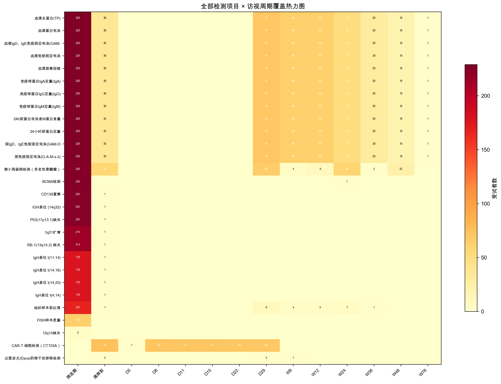

热力图展示全部 28 个检测项目在关键访视周期的受试者覆盖情况。核心检测项目（血清蛋白电泳、游离轻链、免疫固定电泳、免疫球蛋白）在主要随访时间点均有较好覆盖。CAR-T 细胞检测（CT103A）主要集中在早期随访（D5-D29）。FISH 相关检测（13q14 缺失、1q21 扩增等）主要在筛选期执行。

> 数据来源：`reference/raw-data-yance/G957_驯鹿CT103AC004-中心实验室检测结果周汇总-20260206.xlsx`，全部 28 个检测项目

---

## 6. PK-PD 关联探索性分析

### 6.1 分析方法说明

本章节为**探索性分析**，旨在初步观察 CAR-T 扩增参数与疾病标志物变化之间的关系。

- **可用受试者**：8 例（sample.xlsx 与中心实验室数据匹配成功的受试者）
- **PK 参数来源**：NCA 计算结果（见第 3 章）
- **PD 指标**：M 蛋白基线值与最佳应答值、FLC 比值变化、IFE 转阴状态
- **统计方法**：Spearman 秩相关系数
- **局限性**：样本量仅 8 例，且部分受试者 PD 数据不完整，统计检验结果仅供参考

### 6.2 CAR-T 扩增与 M 蛋白应答

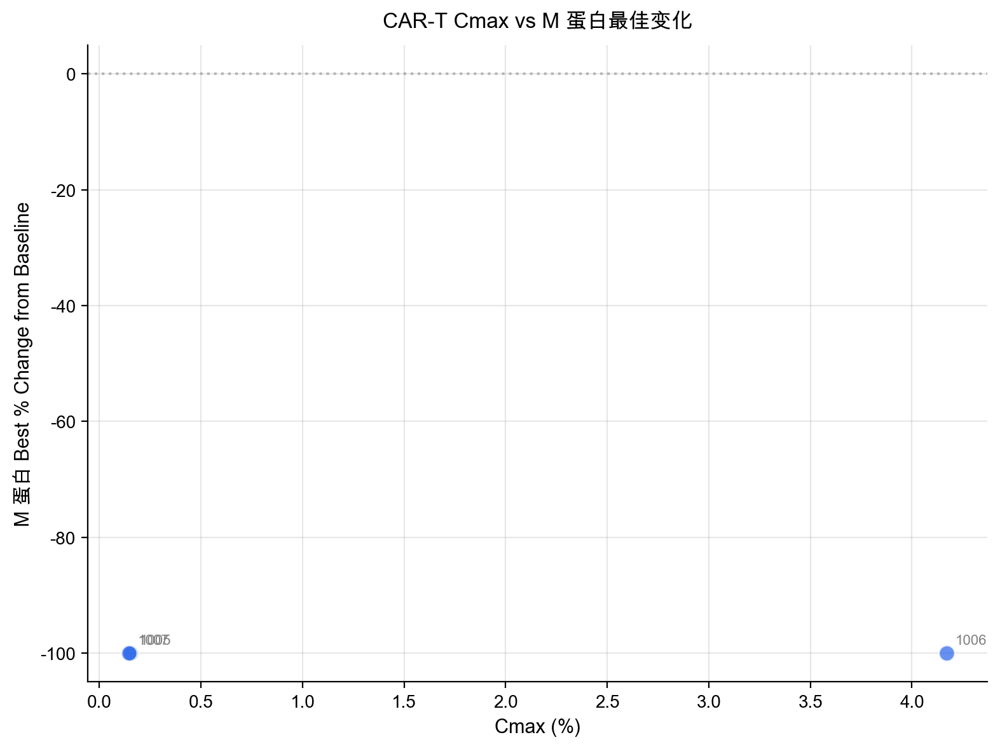

**PK-PD 数据整合表**：

| 受试者 ID | Cmax (%) | AUC0-28d (%.day) | M 蛋白基线 (g/L) | M 蛋白最佳值 (g/L) | Best % Change | FLC 比值基线 | FLC 比值最佳 | IFE 转阴 |
|-----------|----------|-----------------|-----------------|-------------------|---------------|-------------|-------------|---------|
| 1003 | 21.14 | 201.0 | 4.2 | — | — | 116.56 | — | — |
| 1004 | 21.00 | 294.3 | 3.8 | — | — | 0.92 | — | — |
| 1005 | 0.15 | 0.6 | 3.8 | 0.0 | -100.0% | 22.55 | 0.52 | 是 |
| 1006 | 4.17 | 37.9 | 9.6 | 0.0 | -100.0% | 0.49 | 0.71 | 是 |
| 1007 | 0.15 | 0.5 | 16.9 | 0.0 | -100.0% | 0.25 | 0.71 | 是 |
| 1009 | 32.37 | 457.2 | 9.5 | — | — | 0.01 | — | — |
| 1010 | 0.00 | 0.0 | 6.4 | 0.0 | -100.0% | 0.02 | 0.05 | 是 |
| 1011 | 0.00 | 0.0 | 15.4 | — | — | 4.07 | — | — |

> "—"表示该受试者在对应时间点无随访数据
> 数据来源：PK 参数来自 `reference/raw-data-yance/sample.xlsx`（NCA 计算）；PD 指标来自 `reference/raw-data-yance/G957_驯鹿CT103AC004-中心实验室检测结果周汇总-20260206.xlsx`

**观察**：在有 M 蛋白随访数据的 4 例受试者（1005、1006、1007、1010）中，全部达到 M 蛋白 100% 降低（Best % Change = -100%），即完全清除 M 蛋白。值得注意的是，这些受试者的 CAR-T 扩增水平差异极大（Cmax 范围 0.00%-4.17%），提示 M 蛋白清除可能不完全依赖高水平 CAR-T 扩增，低水平扩增也可能足以清除肿瘤克隆。

### 6.3 CAR-T 扩增与 FLC 变化

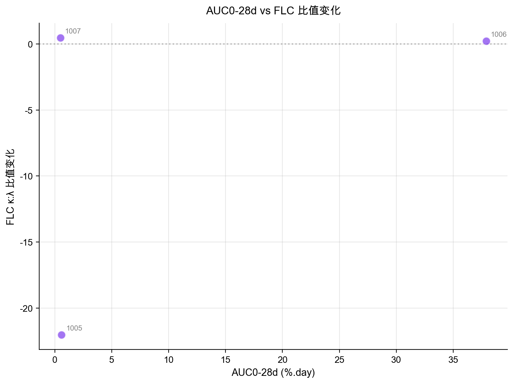

FLC 比值变化方面，有数据的 4 例受试者中：

| 受试者 ID | Cmax (%) | FLC 比值基线 | FLC 比值最佳 | FLC 比值变化 | 正常范围内 |
|-----------|----------|-------------|-------------|-------------|-----------|
| 1005 | 0.15 | 22.55 | 0.52 | -22.03 | 是（0.26-1.65） |
| 1006 | 4.17 | 0.49 | 0.71 | +0.22 | 是 |
| 1007 | 0.15 | 0.25 | 0.71 | +0.46 | 是 |
| 1010 | 0.00 | 0.02 | 0.05 | +0.03 | 否（偏低） |

> 数据来源：`reference/raw-data-yance/G957_驯鹿CT103AC004-中心实验室检测结果周汇总-20260206.xlsx`，检测项目="血清游离轻链"，检测分项="κ:λ 比值"

### 6.4 CAR-T 扩增与 IFE 转阴

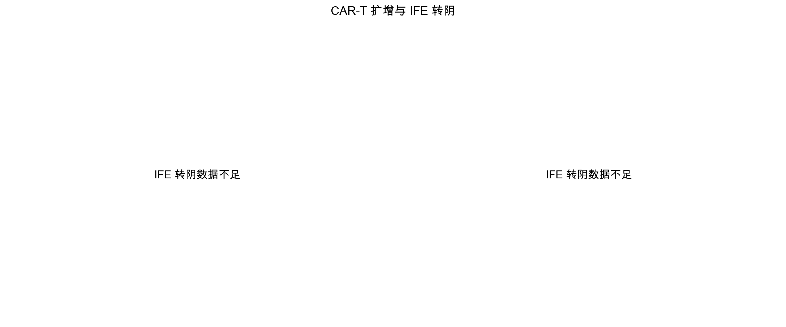

在 8 例匹配受试者中，4 例有 IFE 随访数据且均实现 IFE 转阴（1005、1006、1007、1010）。其余 4 例（1003、1004、1009、1011）缺少足够 IFE 随访数据，无法评估转阴状态。

### 6.5 初步发现

1. **M 蛋白完全清除率高**：有 M 蛋白随访数据的 4 例受试者均达到 M 蛋白 100% 降低
2. **低 Cmax 也可达到深度应答**：受试者 1005（Cmax = 0.15%）和 1010（Cmax = 0%）也实现了 M 蛋白清除和 IFE 转阴
3. **FLC 比值改善**：4 例有数据的受试者 FLC 比值均趋向正常范围
4. **PK-PD 定量关联受限**：由于有完整 PD 数据的受试者 M 蛋白变化均为 -100%（无变异），无法建立 Cmax 与 M 蛋白变化的定量关联

> **重要声明**：以上为探索性分析结果，样本量有限（n = 8，其中仅 4 例有完整 PD 数据），不支持因果性推断。正式结论需更大样本量和严格统计分析验证。

---

## 7. 总结与讨论

### 7.1 主要发现

1. **CAR-T 扩增动力学**：18 例受试者中 15 例（83.3%）检出 CAR-T 细胞扩增，中位 Cmax 为 21.07%（T-cell %），中位 Tmax 为 D10。扩增个体间差异极大（CV 约 96.5%）。
2. **PK 参数**：中位 AUC0-28d 为 294.3%.day，中位 t1/2 为 10.2 天（10/18 例可计算），2 例 t1/2 超过 20 天提示长期持续。
3. **数据质量良好**：中心实验室数据核心字段无缺失，异常样本比例低（0.89%），反审率 3.18% 且主要为信息录入修正。
4. **生物标志物应答**：M 蛋白、FLC 比值均显示治疗后改善趋势；IFE 阳性率随时间下降。
5. **PK-PD 初步观察**：有限数据提示即使低水平 CAR-T 扩增也可实现 M 蛋白完全清除。

### 7.2 数据质量建议

1. **访视周期命名标准化**：反审记录中大量为访视周期更正，建议在数据采集阶段强化命名规范
2. **异常样本监控**：溶血和脂血是主要异常类型，建议对高异常率中心加强样本处理培训
3. **数据完整性追踪**：部分受试者在后期随访缺少关键生物标志物数据，影响 PK-PD 分析可用性

### 7.3 局限性说明

1. **样本量有限**：CAR-T 动力学数据仅 18 例，PK-PD 匹配仅 8 例（有完整 PD 数据仅 4 例）
2. **ID 匹配不完整**：sample.xlsx 中 10 例受试者无法在中心实验室数据中找到匹配记录
3. **描述性分析**：本报告以描述性统计和探索性分析为主，未做确证性假设检验
4. **t1/2 可计算性**：仅 10/18 例可计算终末半衰期，受限于随访数据点和消除期数据的充分性
5. **无临床应答分级数据**：缺少 IMWG 标准下的应答分类（sCR、CR、VGPR 等），限制了 PK-PD 关联的深度

### 7.4 后续分析建议

1. **群体 PK 建模**：在更大数据集上建立 CAR-T 细胞扩增的群体药代动力学模型，识别影响扩增的协变量
2. **暴露-应答分析**：结合正式临床应答数据（IMWG 标准），建立 Cmax/AUC 与应答深度的定量关系
3. **安全性-暴露分析**：纳入 CRS、ICANS 等安全性数据，分析 CAR-T 扩增与不良事件的关系
4. **长期持续性分析**：对 D180+ 仍可检出 CAR-T 细胞的受试者进行深入分析，探索持续性的预测因素
5. **MRD 关联**：将微小残留病（MRD）检测数据与 PK 参数关联，评估 CAR-T 暴露与 MRD 阴性率的关系
